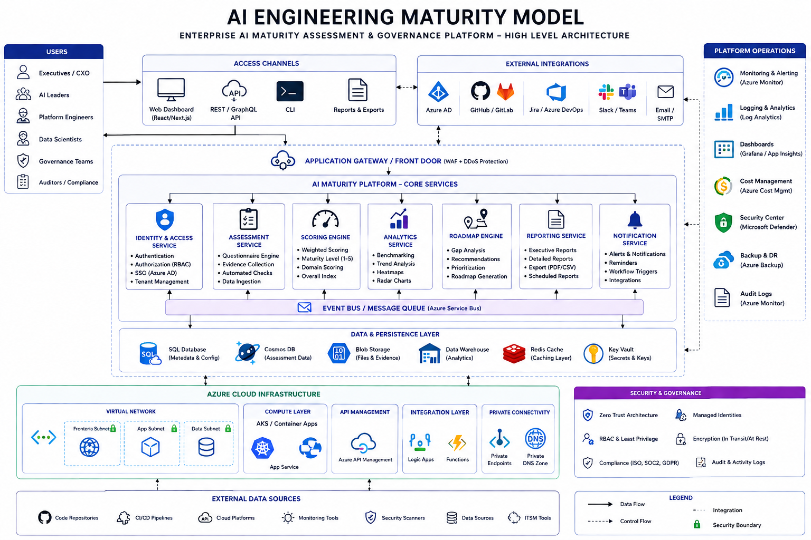
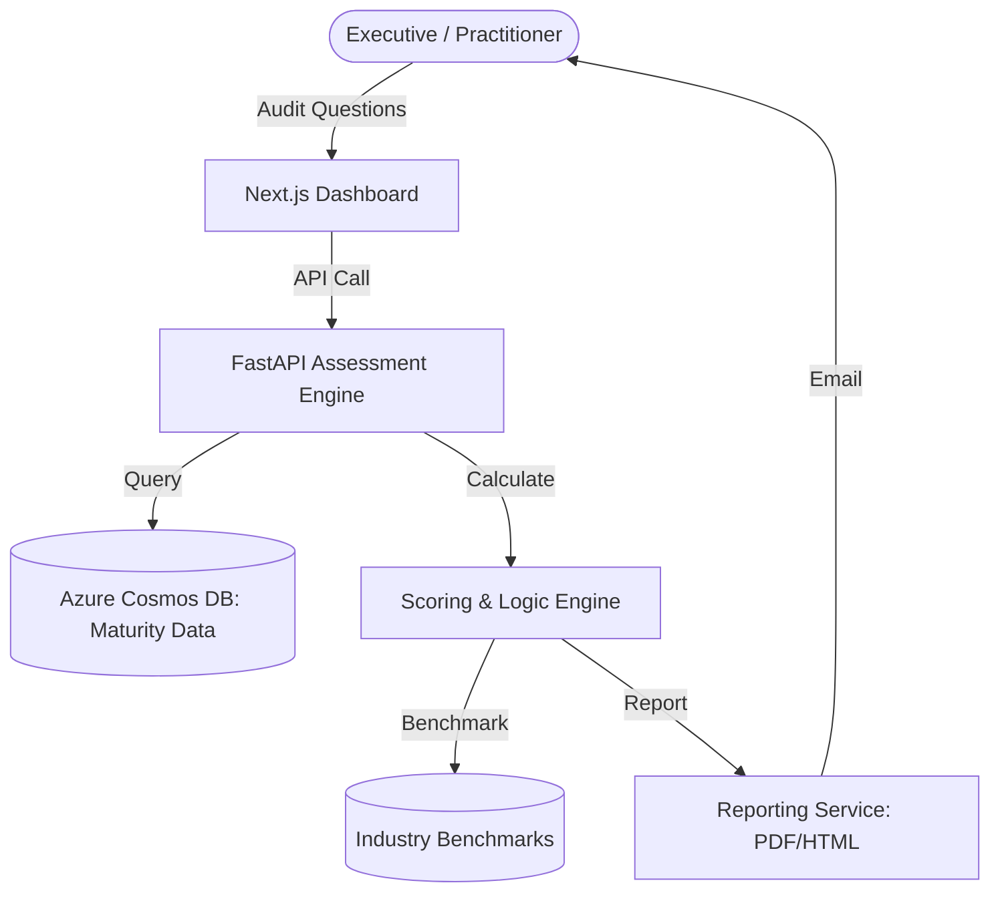
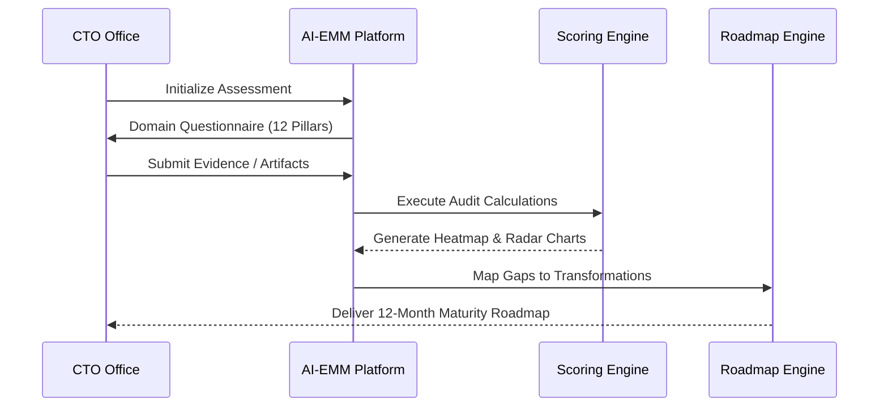
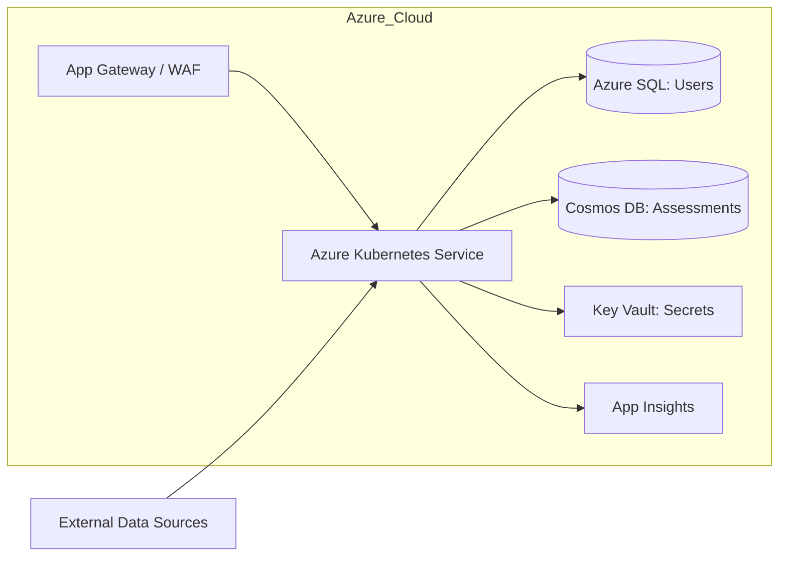
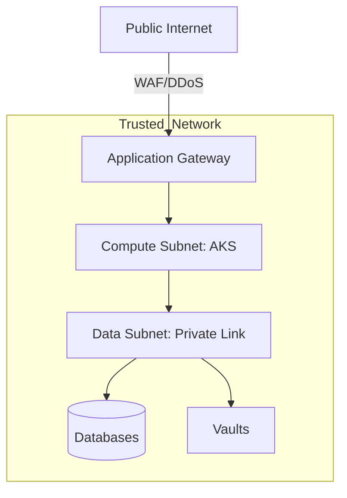
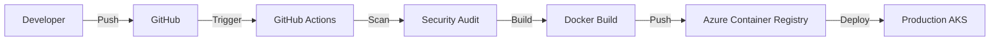



<h1>AI Engineering Maturity Model (AI-EMM)</h1>

<strong>Enterprise-Grade Assessment, Benchmarking, and Governance for the Modern AI Transformation</strong>

 

> **"Scaling AI is an engineering challenge, not just a data science one."** The AI-EMM platform provides a systematic framework to audit, govern, and accelerate AI engineering capabilities across the global enterprise.

---

## 🏛️ Executive Summary

The **AI Engineering Maturity Model (AI-EMM)** is a comprehensive assessment and transformation platform designed to help organizations move from "Fragile AI Experiments" to "Industrial-Grade AI Platforms." It provides a data-driven methodology to evaluate engineering rigor, security posture, and business value realization.

### The Objective
- **Benchmark**: Where do we stand compared to industry standards?
- **Govern**: Are our LLM and ML workloads secure, ethical, and compliant?
- **Accelerate**: What specific engineering gaps are blocking our AI ROI?
- **Scale**: Is our MLOps/LLMOps operating model ready for 100+ models?

---

## 📐 Maturity Domains & Scoring

We evaluate maturity across **12 Core Domains**, each scored from **Level 1 (Initial)** to **Level 5 (Optimized)**.

| Domain | Focus Area | Maturity Driver |
|:---|:---|:---|
| **Strategy & Leadership** | Alignment & Funding | ROI-centric AI Roadmapping |
| **AI Governance** | Ethics & Compliance | Policy-as-Code for LLMs |
| **Security & Responsible AI** | Safety & Trust | Red-Teaming & Guardrails |
| **Data Readiness** | Quality & Lineage | Real-time Feature Stores |
| **ML Platform Engineering** | Infrastructure | Shared "Golden Path" Platforms |
| **LLMOps Readiness** | GenAI Lifecycle | RAG Pipeline Orchestration |
| **DevSecOps Automation** | Pipeline Integrity | Vulnerability Scanning for Models |
| **Model Lifecycle** | Versioning & Registry | Automated Champion/Challenger |
| **Observability** | Drift & Bias | Real-time Performance Monitoring |
| **FinOps / Cost** | Token Economy | Unit-cost per Prediction |
| **Talent & Culture** | Skill Transformation | AI-Fluent COE Development |
| **Business Value** | KPI Attainment | Realized Productivity Gains |

---

## 🏗️ High-Level Architecture

The platform centers on a **Stateless Assessment Engine** backed by a **Graph-based Scoring Model**.

---

## 🗺️ Visual Architecture Spec

### 🔄 User Journey Flow

### ☁️ Azure Deployment Topology

### 🛡️ Security Trust Boundary

### 📦 CI/CD Pipeline Flow

---

## 🛠️ Technology Stack

| Layer | Technology | Purpose |
|:---|:---|:---|
| **Frontend** | Next.js 14 + TailwindCSS | Modern, Responsive Analytics |
| **Backend** | Python 3.11 + FastAPI | High-Performance Logic & API |
| **IaC** | Terraform / Bicep | Declarative Multi-Cloud Foundations |
| **Database** | Azure SQL + Cosmos DB | Structured Metadata + Audit Artifacts |
| **Observability** | Prometheus + Grafana | Performance & KPI Tracking |

---

## 🚀 90-Day Maturity Transformation

- **Day 0-30**: Baseline Assessment & Gap Identification.
- **Day 31-60**: Implementation of MVP MLOps/LLMOps Guardrails.
- **Day 61-90**: Organizational KPI Alignment & Scaled Platform Onboarding.

---

## 🆘 Support & Consulting
Devopstrio provides dedicated **Enterprise Transformation Support** for organization-wide maturity rollouts.

- **Web**: [devopstrio.co.uk](https://devopstrio.co.uk)
- **Consulting**: [maturity@devopstrio.co.uk](mailto:maturity@devopstrio.co.uk)

---
&copy; 2026 Devopstrio &mdash; Scaling AI Engineering Excellence.
